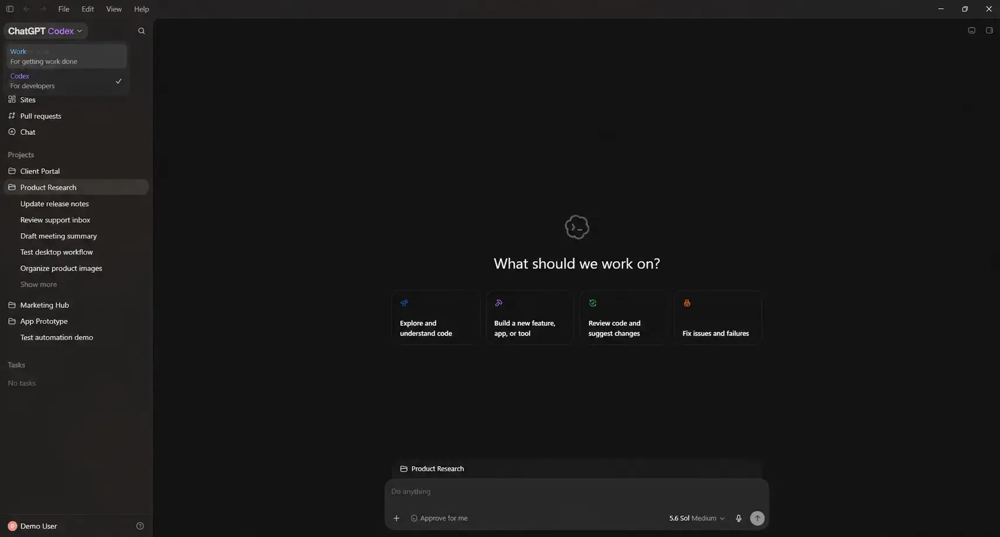

**Versão:** 0.2.2  
**Última revisão das fontes:** 18 de agosto de 2026  

- A leitura essencial cabe em cerca de 5 minutos; o restante é opcional.
- Não há exercícios, exemplos nem uso do terminal neste guia.
- O aprofundamento aponta para a documentação oficial da OpenAI.
- Este é um guia para o Codex, mas a lógica vale para Claude Code, Cursor, Antigravity, etc.


# Introdução: Codex na prática

Você usa soluções de IA somente no modo chat?

- Rotina: anexar um arquivo, adicionar contexto, pedir uma transformação, baixar o resultado e repetir?

Este guia mostra o salto para o Codex no aplicativo desktop.

O gargalo imediato costuma ser o fluxo, não o modelo de IA:

- A **pasta** passa a ser a referência do trabalho e cada **chat** registra uma tarefa.

{fig-alt="Captura do ChatGPT Codex no Windows: seletor Work e Codex, barra lateral com pastas de projeto e chats, área central com a pergunta What should we work on."}

Fonte: [ChatGPT for Windows](https://www.windowsmode.com/chatgpt-for-windows/), Windows Mode. A interface pode diferir da versão atual do aplicativo.

## 1. Crie um projeto na pasta e pare de tratar arquivo como anexo {#crie-um-projeto-na-pasta-e-pare-de-tratar-arquivo-como-anexo}

**Recomendação**

- Abra um projeto local no aplicativo desktop e aponte a pasta do trabalho.
- Deixe de enviar e baixar arquivos pela interface do navegador.

**Por que / ganhos**

- Fica uma versão canônica no disco, sem o ciclo anexar / baixar / “qual é o arquivo certo?”.
- O Explorador de Arquivos continua sendo a fonte da verdade.
- O chat registra a tarefa, não o acervo de arquivos.

**Na prática**

- Crie o projeto local, aponte a pasta e, se houver várias, defina a principal.
- Separe entradas ("inputs"), referências (para consulta) e resultados ("outputs").
- Com o Codex você pode orientar quais subpastas importam.
- Um contexto bem selecionado rende mais do que anexos grandes sem função.

::: {.callout-caution}
Pasta local não é modo offline: conteúdo necessário ao processamento pode
ser enviado aos serviços do aplicativo. Não use a Área de Trabalho nem a
raiz de um disco como projeto.
:::

## 2. Comece com o Modo Planejamento (mesmo em projetos simples)

**Recomendação**

- No primeiro pedido do projeto, sempre que o resultado não for óbvio, use o **Plan mode** antes de começar a escrita ou edições.

**Por que / ganhos**

- Você vê o plano (e o entendimento) do que deve ser feito antes de o agente mexer em arquivos.
- Pedidos muito extensos, vagos ou não óbvios (leia-se: boa parte de nossas necessidades) deixam de virar execução às cegas.
- O escopo do trabalho fica explícito e o receio de alterações indevidas diminui.
- Você pode pedir para salvar o plano em um arquivo.

**Na prática**

- Peça um plano. Verifique o que entra e o que sai, quais arquivos mudam e como conferir os resultados.
- Confirme as decisões que julgar adequadas, ou revise pontos específicos. Só então peça a execução do plano já revisado.

::: {.callout-caution}
**Não confunda execução com a criação de um novo pedido.**  
Plano sem execução não entrega o resultado. Depois de aceitar, peça a
execução em termos desse plano e não de um pedido novo e vago. 
:::

## 3. Grave o plano no disco: *spec*, histórico e convenções

**Recomendação**

- Não deixe o acordo só no fio do chat. Grave-o em arquivos na pasta do projeto.
- Isso é a prática de *spec-driven development* (desenvolvimento orientado por especificação): um acordo escrito do que deve ser feito.
- A prática vale para código, pesquisa, análise e produção de documentos.

**Por que / ganhos**

- O disco vira memória além da janela de contexto. Chats novos herdam o histórico sem colar tudo de novo, e você revisa um texto estável.
- O histórico de alterações permite ver o progresso e as decisões tomadas.
- Ao aceitar o plano, peça “grave isto em `plano.md`”, por exemplo.
- Ao fechar uma fase, acrescente uma linha no `CHANGELOG.md`.

**Na prática**

- Nomes podem variar; `.md` (markdown) é preferível, `.txt` também serve.
  - `plano.md`: objetivo, fontes, fora de escopo e critério de pronto.
  - `CHANGELOG.md`: o que já foi feito em fases anteriores (histórico de alterações, versionamento, etc.).
  - `AGENTS.md` ou `convenções.md`: regras duráveis (idioma, não sobrescrever entradas, citar fonte, etc.).
- Em pesquisa, se fizer sentido: `plano-pesquisa.md`, `fontes.md`, `metodologia.md` (notas de decisões metodológicas), etc.

## 4. Troque o modelo e o esforço conforme a tarefa

**Recomendação**

- Não deixe o modelo padrão o tempo todo. O mais poderoso nem sempre é o necessário.
- Combine a capacidade do modelo com o nível de raciocínio (esforço) de cada tarefa.

**Por que / ganhos**

- Trabalho rotineiro fica mais rápido e consome menos tokens.
- A qualidade se concentra onde há julgamento, ambiguidade ou risco.

**Na prática**

Olhe o seletor de modelo e o esforço antes de enviar o pedido.

- Tarefas simples e delimitadas (renomear, extrair campos, padronizar, resumir uma pasta já inspecionada): um modelo mais leve com esforço alto costuma bastar. Exemplo atual: **GPT-5.6 Luna em Extra High**.
- Tarefas ambíguas, de julgamento ou de alto risco: reserve **Terra** ou **Sol** e suba o esforço se a primeira passagem falhar.
- Se emperrar, troque modelo ou esforço num chat novo.

::: {.callout-caution}
Extra High no Luna não substitui revisão humana nem Plan mode. Nomes e
disponibilidade dependem do plano e da versão do aplicativo.
:::

## 5. Abra um chat novo quando o assunto mudar

**Recomendação**

- Um chat, um resultado.
- Quando o assunto mudar, abra outro chat no mesmo projeto.

**Por que / ganhos**

- Instruções antigas não competem com as novas.
- Menos contexto irrelevante (e menos tokens) é um ganho.
- Fica mais fácil ver o que cada chat fez.

**Na prática**

- Título pelo objetivo da tarefa ou pela ordem das tarefas:
  - Ex.: "Síntese dos relatórios de julho" ou "1. Asdf", "2. Asdf", "3. Asdf", etc.
- Continue no mesmo chat só para corrigir a *mesma* meta.
- Se o projeto for muito grande, pode ser útil arquivar o que já concluiu ou o que não é mais relevante.

::: {.callout-caution}
**Dois chats não devem escrever o mesmo arquivo ao mesmo tempo.**
:::

## 6. Você continua no controle: o Codex não apaga o computador

**Recomendação**

- Trate o Codex como um agente com acesso à pasta autorizada e use as permissões a seu favor.

**Por que / ganhos**

- No chat do navegador a IA não mexe no disco; o risco é cópia, upload e perda de versão.
- No Codex ela pode criar, editar ou apagar **dentro da pasta do projeto**, mas só com permissões, sandbox e a sua aprovação (comando, alvo, motivo).
- Abrir um projeto não entrega o computador inteiro.

**Na prática**

- Comece em só leitura e autorize escrita depois do plano.
- Leia o pedido de permissão (comando, alvo, motivo) e não aprove no automático.
- Preserve originais e separe entrada (*inputs*) e resultado (*outputs*).
- Nunca sobrescreva o único exemplar na primeira tentativa.
- Confirme classificação e autorização de documentos profissionais antes.

::: {.callout-caution}
**Permissões não substituem revisão humana de números, documentos formais e das alterações nos arquivos.**
:::

## Primeira sessão: cinco passos

1. Crie o projeto local e aponte a pasta do trabalho (não a Área de
   Trabalho).
2. Abra um chat no **Plan mode**, escolha o par modelo/esforço da tarefa
   (Luna Extra High se for simples e delimitada) e descreva o resultado com
   os quatro elementos abaixo.
3. Revise o plano; peça para gravá-lo em `plano.md`.
4. Só então autorize a execução. Confira os arquivos no Explorador, não só
   a mensagem final.
5. Arquive ou encerre a tarefa. Abra um **novo chat** para o próximo
   resultado. Se a fase fechou, acrescente uma linha no `CHANGELOG.md`.

Um pedido curto pode seguir este modelo:

```text
Objetivo: consolidar as conclusões dos relatórios mensais.
Contexto: use somente os PDFs da pasta relatorios-2026.
Restrições: preserve os originais e escreva em português claro.
Concluído quando: existir um resumo.md com fontes e pendências identificadas.
Atualize plano.md com o acordo desta tarefa.
```

O objetivo é o resultado, o contexto aponta os arquivos, as restrições
protegem formato e fontes, e “concluído quando” permite conferir o fim. Se
algo for importante, escreva; não dependa de o agente adivinhar.

# Saiba mais — quando o uso já estiver andando

::: {.callout-note}
Esta parte aprofunda três temas. **Não é necessária para começar.** Volte
aqui quando tarefas longas, regras duráveis do projeto ou PDFs extensos
aparecerem no seu trabalho.
:::

### PDFs extensos, privacidade e consumo de contexto

Antes de usar documentos de trabalho, confirme classificação, autorização e
política institucional. Remover nomes de arquivo não anonimiza
necessariamente o conteúdo. Informações pessoais, sigilosas ou contratuais
podem permanecer no texto, nas tabelas, nos metadados e nas imagens.

- Para PDFs extensos, comece pedindo uma inspeção do tipo de documento,
  quantidade de páginas e disponibilidade de texto.
- Delimite páginas, capítulos ou perguntas quando souber o que procura.
- Um PDF digital pode permitir extração direta; um documento escaneado pode
  exigir OCR e revisão adicional.
- Evite reenviar o mesmo arquivo em vários chats sem necessidade. Mantenha
  a fonte na pasta do projeto, preserve um texto extraído quando isso for
  autorizado e peça resultados intermediários compactos.
- Essas práticas reduzem repetição e melhoram o foco, mas não representam
  garantia de uma quantidade específica de tokens ou de custo.
- Separe entrada, transformação e resultado. Em análises sensíveis, prefira
  começar em modo de leitura e só autorize gravações depois de revisar o
  plano.

Retome [Boas práticas do Codex](https://learn.chatgpt.com/guides/best-practices)
para contexto, limites e validação, e confira [Projetos e chats](https://learn.chatgpt.com/docs/projects?surface=app)
para o escopo das pastas locais.


### Goal mode e trabalhos longos

Tarefas longas precisam de um resultado verificável, restrições claras e
uma definição de conclusão. Goal mode mantém esse objetivo visível enquanto
o agente avança por várias etapas. Ele não amplia permissões nem elimina a
necessidade de aprovação quando surgir uma decisão importante.

- Se o objetivo ainda estiver confuso, planeje primeiro.
- Formule a meta em termos do que deve existir ao final, dos limites que
  devem ser respeitados e da verificação que comprovará o resultado.
- Durante a execução, você pode fornecer contexto adicional, ajustar
  restrições ou pedir um resumo de situação.
- Preserve o mesmo chat quando as mensagens ajudam a concluir a mesma meta;
  use outro apenas para trabalho realmente independente.
- Uma tarefa longa mantém a mesma política de sandbox e aprovações; iniciar
  Goal mode não concede acesso adicional ao computador ou à internet.

Consulte [Trabalho de longa duração](https://learn.chatgpt.com/docs/long-running-work?surface=app).

### Detalhes de AGENTS.md

`AGENTS.md` é um arquivo de instruções duráveis para o Codex. Ele registra
regras que não deveriam ser repetidas em todo chat: idioma, convenções de
nomes, comandos de validação, limites de segurança e critérios de conclusão.

- As instruções podem existir no nível global e dentro de projetos.
- O Codex combina as orientações desde a raiz do projeto até a pasta atual;
  arquivos mais próximos do trabalho específico têm precedência sobre
  regras mais gerais.
- Mantenha o arquivo curto, concreto e atualizado. Preferências vagas como
  “faça tudo perfeitamente” ajudam pouco.
- Regras observáveis — “preserve UTF-8”, “não sobrescreva arquivos de
  entrada”, “registre a fonte de cada afirmação” — podem ser verificadas.
- Um `AGENTS.md` não substitui o pedido atual. Ele fornece os acordos
  permanentes; o chat continua precisando dizer qual resultado deve ser
  produzido agora.

Leia [Instruções personalizadas com AGENTS.md](https://learn.chatgpt.com/docs/agent-configuration/agents-md).

## Fontes oficiais e próximos conteúdos

- [Boas práticas do Codex](https://learn.chatgpt.com/guides/best-practices)
- [Projetos e chats](https://learn.chatgpt.com/docs/projects?surface=app)
- [Trabalho de longa duração](https://learn.chatgpt.com/docs/long-running-work?surface=app)
- [Instruções personalizadas com AGENTS.md](https://learn.chatgpt.com/docs/agent-configuration/agents-md)
- [GPT-5.6 no ChatGPT](https://help.openai.com/en/articles/20001354-gpt-56-in-chatgpt)
